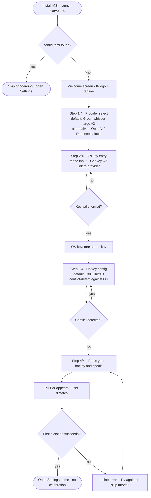
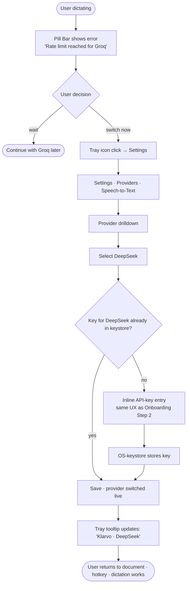
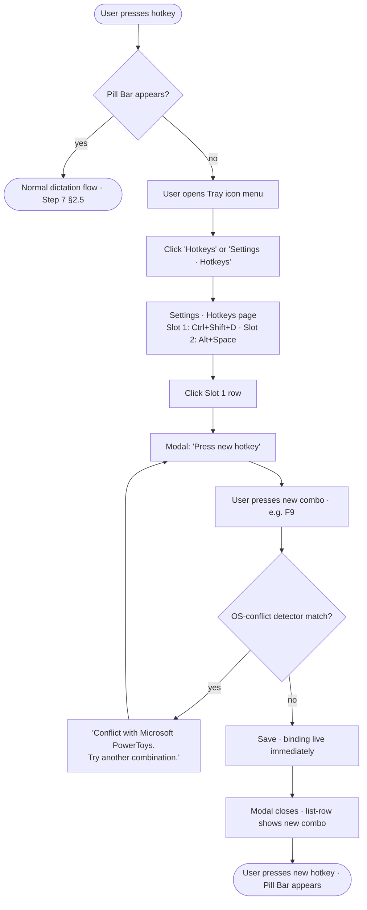
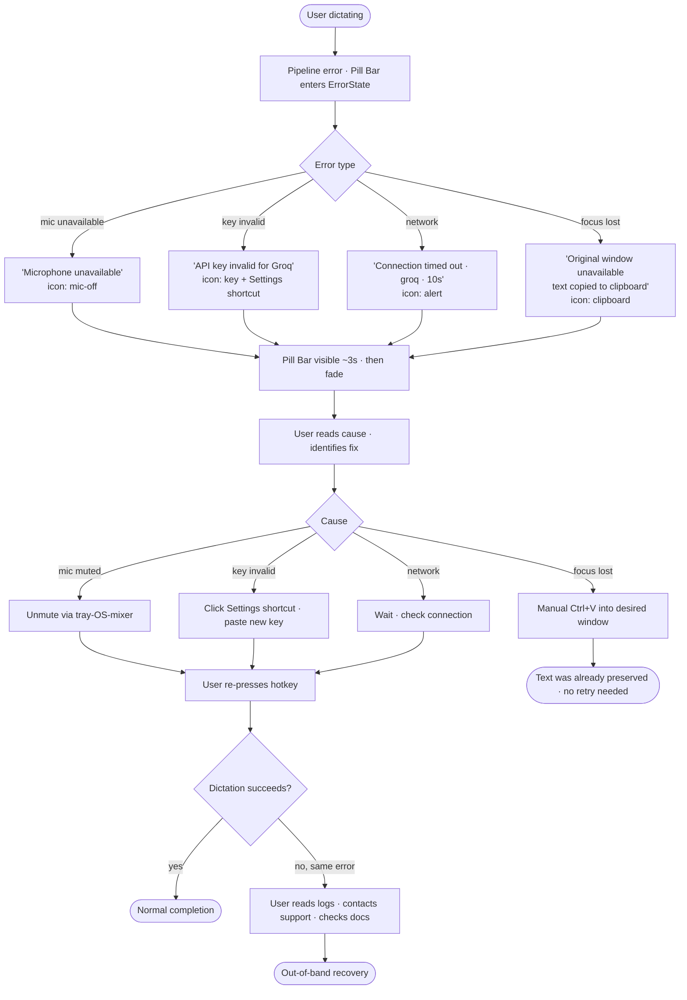

# UX Design Specification — Klarvo v2

**Author:** Andi
**Date:** 2026-05-07

---

## Input Authority Rule

This specification draws from three layers of input. **Authority hierarchy is strict** — when sources disagree, the higher layer wins:

1. **Authority** (`inputDocuments.authority`) — v2 PRD, Brief, Architecture, accepted UX-decisions. Defines *what* v2 must be.
2. **Reference** (`inputDocuments.reference`) — v1 technical snapshot + rebuild discussion. Explains *why* v2 diverges from v1.
3. **Inspiration** (`inputDocuments.inspiration`) — team-knowledge personas, feature-inventory, design briefings, color research, mockups. **Used as inspiration only — never as binding design constraint.** v1's accumulated design thinking informs v2 but does not dictate it.

**Living reference**: v1 source code in `./src/`, `./src-tauri/`, `./android/` (kept in repo as brownfield reference, workspace-excluded from compile) and the running v1 build at `D:\Apps\klarvo`. Stakeholder pulls these up during design sessions to demonstrate "what existed" — they are illustrative, not normative.

---

<!-- UX design content will be appended sequentially through collaborative workflow steps -->

## Method Constraints

This synthesis is single-source. Andy is founder, primary user, and sole interview subject. There are no external user interviews, no v1-user feedback beyond Andy's own observations, no validated personas.

Every item below carries founder-bias risk. Items where Andy-as-source is the decisive evidence are tagged `[founder-hypothesis]` with a validation trigger. Items where external evidence (v1 deep-scan, market analysis, architectural constraint) is decisive are tagged `[evidence-grounded]`.

The brownfield reference (~5300 LOC v1 React in `./src/`) is a temptation, not an inheritance. v1 patterns are inputs to interrogate, not constraints to honor.

## Executive Summary

### Project Vision

Klarvo is a cross-platform dictation tool. Press, speak, release — text appears where the cursor is. Built on a Shared Rust Core with native shells (Tauri/Win, Kotlin/Android, future Swift/iOS+macOS) and a Trait-based plugin architecture. The MVP delivers ~40-45 of v1's 107 features across Windows and Android in parallel.

### The Core Job

A user wants to speak a thought and find it at the cursor — before the thought slips. Latency, accuracy, and trust between mouth and cursor. Everything else is in service of this job, or it does not belong in the MVP.

### Target Users

**Persona 1 — Power-User Writer (Andy-archetype):** `[founder-hypothesis, self-evidenced]`
Primary persona. Identical to founder. Sole source of UX preferences encoded in this document. *Validation trigger:* first external power-user contact (re-activated v1 testers post-MVP).

**Persona 2 — Modular Developer:** `[evidence-grounded via plugin architecture]`
The plugin system and pipeline manifest are designed for this user. The job is real and concrete: "extend the dictation pipeline without writing new code." External evidence: developer demand patterns visible in v1's plugin requests and competitor extension ecosystems.

**Persona 3 — Institutes / Organizations:** `[aspirational]`
Currently a market hypothesis, not a validated user. The Cargo-feature niche-build path is architecturally enabled but has zero current customers. Should not drive MVP UX decisions. *Validation trigger:* first niche-build commission or partnership conversation.

**Persona 4 — RSI / Motor-Impairment Users:** `[partially-evidenced, structurally underserved here]`
The product-value for this group is real. The synthesis treats them as "architecturally first-class" — but architectural first-class ≠ experiential first-class. Body-different users experience a 320×48 fixed Pill Bar differently than Andy. *No interview data exists.* RSI-driven design decisions are currently inferred from architecture, not from users.

**Explicitly NOT target:** Mass-market without tech affinity. BYOK is acceptance filter, not friction-to-remove.

### Key Design Challenges

**1. Failure-state as a designed surface (not a deferral)** `[evidence-grounded]`
A dictation flow has at least five failure modes that are not edge cases — they are part of the steady-state UX: silence at the mic, premature VAD cut, cloud-API timeout, BYOK-key invalid, focus-target window lost during recording. The current Pill-Bar pre-decision (320×48 fix, show-on-recording-only, backend-rendered waveform) has no failure-state catalog. The Pill-Bar disappears at `RecordingCompleted` regardless of whether anything reached the clipboard. For RSI users this is not "annoying" — a lost dictation cannot be re-typed.

**2. Session 2-10, not Session 1, is the hard UX problem** `[evidence-grounded via Persona-1 archetype]`
"<2min from install to first dictation" is a Mass-Market funnel metric being applied to a non-Mass-Market product. Once the user has dictated, the real work begins: switching providers when Groq hits limit, deciding Verbatim isn't right for emails the way it is for code comments, wanting different pipelines per output target. This is where Persona 1 lives — and it is currently absent from the synthesis.

**3. Plugin-Manifest is a Persona-1+2 surface — and a load-bearing one** `[founder-hypothesis on UX form, evidence-grounded on need]`
The TOML pipeline manifest exists architecturally. Whether users edit it is the design question. Three honest scopes: (a) MVP read-only-discoverable (viewer in advanced settings); (b) MVP read-write-via-text-editor (no UI, just file path + reload); (c) MVP UI-based editor with validation. Each carries different architectural debt (user-facing parser errors require i18n keys in core, recovery paths for corrupt manifests, etc.). The synthesis must pick a scope, not gesture at the opportunity.

**4. Verbatim-vs-Polished is a tension, not a default** `[founder-bias acknowledged]`
Verbatim-as-new-default is Andy's preference, presented as product philosophy. The competing user voice exists structurally: a user who dictates because typing hurts (Persona 4) may *want* aggressive cleanup, because the cognitive load of post-editing is the entire reason they're dictating. Treating Verbatim as "new default" hides this. The honest framing is: Klarvo ships three styles, the default is configurable in onboarding, and the v1-Polished failure mode ("rewrites too much") is a problem to solve in the new Polished implementation — not a reason to demote the style.
*Validation trigger:* RSI-user contact, OR observation that Verbatim is selected by Persona-1 only.

**5. Platform-asymmetry is a design subject, not a parity problem** `[evidence-grounded]`
Windows Pill Bar and Android Bubble will diverge — Android has notification channels, system-overlay permissions, foreground-service obligations, background-lifecycle constraints that Windows simply does not have. The question is not "how do we keep them similar" but "where is Klarvo deliberately a different product on Android?". Forcing parity reproduces the v1 bypass problem in the UX layer.

### Design Opportunities

**a. Niche-build differentiation via Cargo-features** `[evidence-grounded architecturally, deferred for UX]`
Real architectural property. Not visible at MVP — there will be one build. Treat as long-term moat in marketing communication; do not let it shape MVP UX decisions until a second build exists.

**b. Failure-recovery as differentiator** `[evidence-grounded]`
Inversion of Challenge 1: if Klarvo *clearly* tells the user "key invalid, you spoke for nothing" within 2s of hotkey release, that itself is user value beyond what current dictation tools offer. The Pill Bar can become the trust surface, not just the recording indicator.

**c. Accessibility — design substance, not communication** `[unresolved]`
Marketing accessibility-first is cheap. Designing for it is hard: keyboard-only paths through every surface, hotkey customization that doesn't conflict with AT software, screen-reader semantics for the Pill Bar, audio cues for users who cannot watch the waveform. This is a non-functional-requirement class that is not in any current Phase-1 output. The opportunity is real *if* committed to as design substance — not as a positioning sentence.

### Open Questions Before Step 3

1. **Pill-Bar pre-decisions — open or closed?** The 320×48 fix / not-draggable / show-on-recording-only / backend-rendered-waveform set is currently asserted, not anchored. No ADR exists. Maya, Sally, and Winston each independently flagged that re-opening at least the failure-state aspect is necessary before Step 3.

2. **Persona ordering in the build sequence.** Four personas, three real jobs. Which is built to a finished state first, before the next is started? "All parallel" is currently implicit and likely wrong.

3. **Verbatim-default — keep or convert to "user picks in onboarding"?** Founder-bias decision, currently undocumented as such.

## Core User Experience

### Defining Experience

The visible action is single and well-known: hotkey-press → speak → release → text appears at cursor. But the *defining* experience is what happens across sessions, not within one. The product succeeds when the hundredth dictation feels exactly like the first — no drift, no mystery failures, no "why-was-this-better-yesterday". Klarvo earns its place by becoming invisible through reliability, not by impressing on day one.

### Platform Strategy

**Windows is the primary surface for MVP.** Native Pill Bar overlay (320×48) plus React WebView for persistent panels (Settings, History, Onboarding). Tauri v2 + Kotlin/Android is the architectural backbone; the React WebView is hosted by Tauri, the native overlays are platform-specific.

**Android is parallel and explicitly a different product** — not a port. The Bubble is not a Pill Bar in another shape. Android has notification channels, system-overlay permissions, foreground-service obligations, and AT-software expectations that Windows simply does not have. Where OS conventions diverge, conventions win. There is no "platform parity" goal — there is platform-native correctness on each side.

iOS and macOS are post-MVP. Linux is opportunistic and not designed for.

**Persona priority in design conflicts:** Persona 1 (Power-User Writer / Andy-archetype) wins. Persona 4 (RSI / motor-impairment) is architecturally protected (AccessibilityService on Android, keyboard-only ergonomic on Windows, deep dictionary) but does not drive UX form. This is a deliberate acknowledgment of the founder-bias diagnosed in Step 2 — not a denial of it.

### Effortless Interactions

What must require zero thought:

1. **Hotkey-press to start recording.** No modifier-stress, no conflict-hell, no "is the app even listening". The Tray icon answers "Klarvo is alive" passively; the Pill Bar answers "Klarvo is recording right now".

2. **Single-action stop.** Hold-mode releases on key-up. AutoStop releases on silence. Both are one-step. There is no "click to stop" path.

3. **Paste into the focused window.** Return-Focus is solved at architecture level (Story 9.1). The user does not Alt+Tab, does not Ctrl+V, does not reach for the mouse. Text lands where the cursor was.

4. **Provider switching.** Persona 1 will switch from Groq to DeepSeek when limits hit. This must not require an app restart. Hot-reload of providers is P1, but the *UI affordance* for the switch is Phase-1 concern.

5. **Style switching with visible affordance.** Verbatim is default, but Polished and Chat are not buried in advanced settings. The switch is surfaced where the user actually changes context (likely Tray menu or a persistent settings entry — exact location decided in Step 5+).

### Critical Success Moments

Located in Session 2-10, not Session 1.

**Moment 1 — Session 5, dictation #50 still works exactly like dictation #1.** No accumulating misconfigurations, no provider-state drift, no Pill Bar that "used to recover from network errors and now doesn't". This is trust by absence: the user stops thinking about Klarvo because nothing has burned them.

**Moment 2 — A failure that speaks.** User holds the hotkey, speaks 30 seconds, releases. Mic was muted by Windows. Network was offline. API key expired yesterday. *Klarvo says it within 2 seconds*, in the surface the user is already looking at (Pill Bar at fade-out, replaced with a bounded error state). The user is annoyed at the failure, not at Klarvo. Silent dropped dictations are the cardinal sin.

**Moment 3 — Provider switch without ceremony.** User reaches the Groq free-tier limit mid-task. Switches to DeepSeek in the Settings panel, returns to the document, hotkey-presses, dictates. Five seconds total. No restart, no re-onboarding, no "wait, where was I?".

**Moment 4 — Hotkey re-bind takes effect immediately.** User changes Slot 1 from Ctrl+Shift+D to Alt+Space because of a conflict. The change is live without app-restart. The old binding is gone, the new one works.

**Moment 5 — Pill Bar communicates state, not just activity.** Pill Bar with no waveform = mic captured silence. Pill Bar with red waveform = error, recording aborted. Pill Bar fading after success = audio reached transcription. The visual language is part of the trust contract.
*(This moment is gated by re-opening the Pill-Bar pre-decisions from Step 2 — the current 320×48 fix / show-on-recording-only set has no failure-state catalog.)*

### Experience Principles

**P1 — Trust over time, not dazzle on day one.**
Every UX decision is evaluated against Session 5 and Session 50, not against the demo. If a feature impresses on first use but introduces a Session-3 regression, it is broken.

**P2 — Failures speak. Silences do not.**
Every failure mode in the dictation pipeline has an explicit, user-visible signal within 2 seconds. No silent dropped dictations. No "press hotkey, get nothing, no idea why". This is the line that separates Klarvo from a tool that "usually works".

**P3 — Friction is the filter, not the bug.**
BYOK, PolyForm-NC, and configurability are acceptance filters for users who want control. Persona 1 priority is the deliberate consequence: the product is designed for users who already self-select for these properties. Mass-market ergonomic concerns (hide BYOK, abstract away providers, pre-fill opinionated defaults) are explicitly out of scope.

**P4 — Platform conventions over visual parity.**
Windows Pill Bar and Android Bubble must each feel native to their platform. Visual parity is a designer concern, not a user concern — no user uses both platforms in the same minute. Conventions win when they conflict with "Klarvo identity".

## Desired Emotional Response

### Primary Emotional Goals

The intended emotional response is two-axis: **trust** that accumulates over time, and **sovereignty** that is established up-front and continuously reinforced. These are not equivalents — they operate on different timescales and through different design surfaces.

Trust is *dynamic*. It is earned per session and lost in a single failure. It manifests as the user *forgetting* Klarvo exists between dictations — a tool that disappears into the workflow because it has not burned them. Trust is the property that makes Session 50 feel like Session 1.

Sovereignty is *static*. It is established in onboarding (BYOK, provider choice, hotkey configuration) and reinforced by every visible affordance that makes the user's choices explicit. The user knows which provider is in use, which API key is active, which pipeline is running — and can change any of it without ceremony. Sovereignty is what separates Klarvo from "another dictation tool with hidden defaults".

These two emotions are chosen *against* delight-product conventions. Klarvo is not Notion, Calm, or Duolingo. The Persona-1 user does not want to be charmed; they want to be respected and to have their tool work.

### Emotional Journey Mapping

**First install (Onboarding):** Skepticism → respected. The user expects a wizard that hides things. Klarvo asks for the API key directly, names the provider, and explains nothing it does not need to. The first emotion is *recognition* — "this is built for someone like me, not for someone the marketing thinks I should be".

**First successful dictation:** Surprise → silent satisfaction. The text appears at the cursor without ceremony. There is no "first dictation" celebration screen. The absence of a celebration is the celebration. The user just used their tool.

**Session 2-10:** Watchful → calm. The user is testing whether the first session was a fluke. Trust is on probation. Each successful dictation reduces watchfulness. By Session 10, Klarvo is a habit, not a tool to evaluate.

**A failure (any session):** Frustration → directed frustration. The error is named, the cause is visible, the next step is implied. The user's anger goes to the failure (mic muted, key invalid, network down) — not to Klarvo. Recovery from failure is part of trust-building, not its violation.

**Returning users (months later):** Comfort → continuity. The user's hotkeys are exactly where they were. Their dictionary is intact. Their provider settings have not "auto-updated to a new default". The product respects long-term familiarity.

**A betrayal (rare, severe):** A silent dropped dictation, an opaque failure, a default that changed without notice. This is the emotion the product cannot afford. One betrayal in fifty sessions is two too many.

### Micro-Emotions

**Critical positive states:**

- **Confidence** (over Confusion). The user knows what is happening at every step. Recording state, provider in use, pipeline configuration — visible, not hidden.
- **Trust** (over Skepticism). The product earns benefit-of-the-doubt by demonstrating reliability over time. Skepticism is the natural starting state and must be defeated by behavior, not by marketing copy.
- **Control** (over Helplessness). When something breaks, the user has a path forward. There is always a next action — even if it is "read the log, check your key, retry".
- **Recognition** (over Anonymity). The user senses that someone built this for *them* — a power-user with control preferences and tolerance for technical depth — not for a generic mass-market persona.

**Negative states to actively prevent (all three equal weight):**

- **Anxiety:** lost dictation with no explanation. Antidote: P2 (Failures speak). Every silent failure is a P0 bug.
- **Patronizing feel:** hidden defaults, abstracted providers, "we know what's best for you" affordances. Antidote: visible configuration state, named providers, explicit defaults that the user can audit.
- **Shallow novelty:** animations and polish that do not serve a function. Antidote: every animation has a reason (state change, error indication, feedback). No motion for motion's sake.

### Design Implications

| Emotion target | UX consequence |
|---|---|
| Trust through reliability | No state that "usually works". Every failure mode has a designed response. Pill Bar carries error states (gated by re-opening the pre-decisions). Logs are exportable, not buried. |
| Sovereignty through visibility | Provider name is visible during dictation (Tray tooltip or Pill Bar status). API key state is auditable. Pipeline manifest is at minimum read-only-discoverable in MVP. |
| Calm confidence in steady-state | No notifications that aren't warranted. No "did you know?" tooltips. Tray icon is passive. Pill Bar appears only during recording. |
| Anti-anxiety | 2-second rule for failure surfacing. No silent drops. Fade-out of Pill Bar on failure is replaced with bounded error display before fade. |
| Anti-patronizing | No hidden defaults. Onboarding shows provider name, model, pipeline. User can decline cloud-first defaults and configure local from the start (P1 feature, but the affordance is documented). |
| Anti-shallow-novelty | Every animation is a state-change communication. No celebratory micro-interactions. The product is quiet. |

### Emotional Design Principles

**E1 — Earned trust, not promised trust.**
Marketing copy and onboarding screens cannot establish trust — only behavior over sessions can. Design choices that promise reliability ("Klarvo never loses your dictation!") without delivering it are anti-features. Trust is built by Session 5 working exactly like Session 1.

**E2 — Sovereignty is visible, or it does not exist.**
A hidden default is a removed choice. Every meaningful configuration state (which provider, which key, which style, which pipeline) is surfaced where the user works. Sovereignty as a backend property without UI presence is theater.

**E3 — Failures redirect frustration outward, not inward.**
When something fails, the user must blame the failure cause (network, mic, key) — not Klarvo. The failure communication makes the cause specific, the next action obvious, and Klarvo's role in the failure transparent (no scapegoating, no over-apologizing).

**E4 — Quiet, not silent.**
The product communicates through its surfaces (Pill Bar, Tray, Settings panels) but does not interrupt. There are no popups, no upsell prompts, no "did you mean?" suggestions. Every signal earns its visibility — and silence is reserved for steady-state success.

## UX Pattern Analysis & Inspiration

### Inspiring Products Analysis

**KaraFun** — *Reference: settings architecture, control language, spacing rhythm*
KaraFun's drill-down settings navigation, generous spacing (16-24px), colored icon badges, and clean toggle/slider/modal patterns are the established design DNA from the v1 design pass (`briefings/design/concept-v2.md`, `briefings/design/inspiration-karafun.md`). All four pattern groups carry over to v2 unchanged. The KaraFun-DNA is strongest in the WebView panels (Settings, History, Onboarding) where v1 patterns had the most maturity.

**Wispr Flow (Android)** — *Reference: persistent overlay UX, gesture economy*
Wispr Flow's Android implementation is the closest existing reference to Klarvo's Android Bubble — persistent floating overlay that appears with the keyboard, gesture-distinct interactions (tap, long-press, drag). Documented in `~/workspace/teams/klarvo/knowledge/wispr-flow-android-ux.md`. Klarvo's Bubble is not a copy, but Wispr Flow demonstrates which patterns power-users accept and which feel intrusive.

**Superwhisper / WhisperFlow / Aiko (macOS)** — *Reference: native-overlay aesthetic, transient communication*
These are the existing best-in-class for desktop dictation overlays. They are Apple-platform tools and inform the *aesthetic* of a transient, system-level utility but not the implementation. Klarvo's Pill Bar should feel as native to Windows as Superwhisper does to macOS — without copying its visual language.

**Linear / Raycast** — *Reference: power-user respect, no-onboarding-wizard*
Both products treat users as competent adults: minimal onboarding, keyboard-first, no celebration screens. The first interaction is the work itself, not a tutorial. This aligns with Klarvo's Persona-1 priority and the "respected, not charmed" emotional goal from Step 4.

**Historical artifacts (not active inspiration):**
- 21 Notion-style mockups in `briefings/design/screenshots/` (notion-v2..v5) remain as historical exploration. Per Andy's Step-5 review, they do not carry forward as v2 design direction. Kept for reference only.

### Transferable UX Patterns

**Settings & Configuration Surfaces (WebView):**
- KaraFun drill-down navigation. Each settings page is a focused screen with back-button, single subject, clean form controls.
- KaraFun colored icon-badge system. Color hue carries category meaning (Audio / License / System / etc.) — exact palette open per Step-5 decision.
- Inline status badges (PRO / TRIAL / LOCKED) attached to feature entries — direct expression of Step-4 E2 (sovereignty visibility).

**Transient Recording Surfaces (Pill Bar / Bubble):**
- Wispr Flow gesture differentiation (tap-vs-long-press-vs-drag) — Android Bubble gesture vocabulary.
- Superwhisper-class native-feel: minimal chrome, clear state, decisive presence/absence.
- Pill Bar carries trust state (recording, error, success-fade). Behavior derived from Step-3 P2 + Step-4 E1.

**Interaction Patterns:**
- Linear / Raycast minimal-onboarding: ask only what is necessary, name the providers, expose configuration up-front.
- KaraFun centered-modal with clear CTA for confirmations and one-shot decisions only — never for trivial actions.
- KaraFun pill-toggle and slider components for boolean / range settings.

### Anti-Patterns to Avoid

**From the dictation / voice-tool category:**
- **v1 Polished's aggressive rewriting** — overcorrects user voice into "professional prose". v2 Polished must be re-implemented as "filler removed, grammar correct, voice preserved" (brief decision).
- **Microsoft Voice Typing's hidden settings** — no provider choice, no model choice, no audit. Direct sovereignty violation.
- **Dragon NaturallySpeaking's dialog-heavy training flow** — wizards before work. Excluded.
- **Wispr Flow / WhisperFlow vendor lock-in** — single provider, no BYOK. Klarvo's identity is the inverse.

**From general SaaS / consumer apps:**
- **Wizard-heavy onboarding** with "step 3 of 7" progress bars. Mass-market funnel pattern; Persona-1 does not reward wizards.
- **Promotional hero-cards / gradient banners** (already rejected in `concept-v2.md`). Entertainment-app logic, wrong category.
- **Bottom Tab Bar with 4 equal tabs** (already rejected in `concept-v2.md`). Klarvo has primary focus + secondary tools, not 4 equal areas.
- **Big page titles on desktop** (already rejected in `concept-v2.md`). Wastes vertical space in a utility window.
- **Celebratory micro-interactions** — confetti, "Great job!", first-dictation celebration screens. Step-4 E4 violation.
- **Modal-heavy decision flows** — popups for trivial confirmations. Modals are reserved for genuine destructive actions or one-shot decisions.

**From the brownfield (v1 patterns to interrogate, not honor):**
- v1's React component sprawl (~5300 LOC, 14 components in `src/components/`) included Cost Dashboard, Whisper Model Manager, LLM Model Manager, Snippets Panel, Voice Notes Panel, etc. Some are MVP features (History), most are P1/P2. The temptation is to port. The discipline is to design fresh from MVP scope, not from v1 surface area.

### Design Inspiration Strategy

**What to adopt (verbatim or near-verbatim):**
- KaraFun spacing rhythm and visual hierarchy.
- KaraFun drill-down settings architecture.
- KaraFun colored icon-badge system (palette TBD per open Step-5 decision).
- KaraFun toggle / slider / modal component language.

**What to adapt:**
- Wispr Flow Bubble UX → Klarvo Android Bubble. Adopt gesture vocabulary and persistence rules; replace vendor-locked aesthetic with BYOK / plugin DNA.
- Superwhisper-class aesthetic → Klarvo Pill Bar on Windows. Adopt native-feel and trust-state visibility; do not copy macOS-specific visual language.
- Linear / Raycast onboarding restraint → Klarvo onboarding flow. No wizards, name everything, expose providers from screen one.

**What to avoid:** All anti-pattern categories above.

**Open decisions (re-anchored in Step 6+):**
- Color palette is open per Andy's Step-5 answer — v2 may diverge from Teal #14B8A6 / Orange / Slate. The KaraFun pattern adoption is independent of the palette choice.
- Pill Bar / Bubble visual language between platforms is deliberately divergent (Step-3 P4) — only behavioral patterns (state visibility, error display, trust-by-presence) are shared. Visual divergence is feature, not inconsistency.

## Design System Foundation

### Component Library Choice

**WebView surfaces (Settings, History, Onboarding):** **Tailwind v4 + shadcn/ui (copy-in components, Radix primitives underneath).**

**Android Bubble:** **Material Components for Android** (Jetpack Compose Material3). Native is the right answer here; the Bubble is a system-overlay, not a WebView.

**Native Pill Bar (Windows):** Standalone HTML/CSS/Canvas (already implemented at `shells/windows/src/pill-bar.html`). No component library — the Pill Bar is a single state-machine surface, not a composition of components. Tokens import from the shared `tokens.css`, but no React, no shadcn.

### Rationale

1. **v1 hand-rolled scale is unsustainable.** v1's ~5300 LOC React surface contains 14 components built without a primitives library — every dialog, slider, switch, dropdown was custom-rolled. Time spent re-fixing accessibility, focus management, and keyboard behavior is exactly the productivity hole the v2 rebuild exists to escape.
2. **Accessibility floor for Persona 4.** Radix primitives (the foundation under shadcn/ui) ship with WAI-ARIA semantics, focus trapping, keyboard navigation, and screen-reader behavior built in. Persona 4 requires this as floor, not as v2 stretch goal.
3. **KaraFun patterns map cleanly to Radix primitives.** Drill-down lists, toggle/slider/modal vocabulary, colored icon badges — every adopted KaraFun pattern is implementable as a composition of `Switch`, `Slider`, `Dialog`, `Select`, `Tabs` from shadcn/ui. The pattern adoption is unchanged; the implementation labor is what changes.
4. **No npm-lock-in matches sovereignty positioning.** shadcn/ui is copy-in: components live in our repo as ordinary `.tsx` files, customizable line-by-line. There is no peer-dependency tree to satisfy, no major-version breaking change to track, no upstream maintainer who can deprecate a primitive. This matches Klarvo's BYOK / plugin / no-vendor-lock identity.
5. **Tailwind already in v1 toolchain.** v1 uses `@tailwindcss/vite`. Tailwind v4 is the natural continuation. shadcn/ui defaults to Tailwind. Zero churn cost.

### Why not the alternatives

- **Headless UI (Tailwind Labs).** Smaller primitive set than Radix. shadcn/ui already gives Radix-quality primitives plus a starting visual layer.
- **Hand-rolled (v1 path).** Exactly the productivity disaster the rebuild rejects. Listed only to be explicit.
- **MUI / Chakra / Mantine.** Brings Material / branded aesthetic that fights KaraFun pattern adoption and Klarvo's quiet-utility tone. Bundle cost is also material.
- **No library at all (just Tailwind).** Possible, but discards the accessibility floor that Persona 4 requires.

### Tokens — Single Source of Truth

`design-tokens.toml` (committed at repo root or `klarvo-core/`) is the canonical token source. A build step (xtask or pre-build script) generates:

- `shells/windows/src/styles/tokens.css` — CSS custom properties (`--klarvo-color-trust-fg`, `--klarvo-spacing-3`, `--klarvo-radius-md`, …) consumed by Tailwind v4 (`@theme` block) and the standalone Pill Bar HTML.
- `android/.../Tokens.kt` (or v2 equivalent under the Kotlin Compose tree) — Kotlin constants consumed by Material Components composables.

This satisfies the cross-surface contract: a token value lives in exactly one file. Renaming `--klarvo-color-trust-fg` is a single edit; the generator emits both targets. Drift between Windows tokens and Android tokens becomes a generator-bug class, not a recurring design-review class.

### Token Categories (initial scope)

The categories are fixed in this step; concrete values are deferred to Step 8 (Visual Foundation) where the palette decision lands.

- **Semantic colors** — `trust.fg / trust.bg / trust.accent`, `error.fg / error.bg`, `surface.0..2`, `text.primary / text.secondary / text.muted`. Semantic naming is mandatory; raw `gray-700` references are anti-pattern.
- **Spacing scale** — 4 / 8 / 12 / 16 / 24 / 32 / 48 / 64 px (Tailwind-aligned). KaraFun's 16-24px rhythm sits in the middle.
- **Timing** — `fast = 150ms`, `medium = 250ms`, `slow = 400ms`. Every animation in the product uses one of three values. No bespoke durations.
- **Typography** — `display / heading / body / caption / mono` semantic classes. Concrete font-family / size / line-height resolved Step 8.
- **Radii** — `sm = 4px`, `md = 8px`, `lg = 12px`, `pill = 999px` (Pill Bar carries `pill`).
- **Elevation** — three steps: `surface`, `floating`, `overlay`. Pill Bar carries `overlay`.

### Implementation Approach

1. **Foundation tokens.** `design-tokens.toml` lands first. Generator task scaffolded as part of the design-system bootstrap. Concrete values are placeholders until Step 8.
2. **shadcn/ui primitives.** `npx shadcn@latest init` then add: `button`, `switch`, `slider`, `dialog`, `select`, `tabs`, `tooltip`, `toast`. These are sufficient for KaraFun pattern reproduction.
3. **Compound patterns.** KaraFun-style settings list-row (icon-badge + label + control + chevron) is composed from primitives, lives in `shells/windows/src/components/settings/`. Not a shadcn component — a Klarvo-specific composition.
4. **Pill Bar standalone.** `shells/windows/src/pill-bar.html` keeps its current canvas-rendering implementation. Only token import changes (currently hard-coded `rgba(13, 15, 20, 0.85)` and `rgba(42, 195, 168, ${alpha})` move to `var(--klarvo-color-overlay-bg)` / `var(--klarvo-color-trust-fg)`).
5. **Android Bubble.** Kotlin Compose with Material3 + Klarvo `Tokens.kt` overrides. Bubble visual language is deliberately not the same as Pill Bar (Step-3 P4) — palette and motion tokens are shared, layout and gestures are platform-native.

### Customization Strategy

- **Token-level overrides** are the default override path. Component code rarely changes; tokens change. A theme rev (e.g., light mode if ever shipped) is a token-file swap, not a component-file rewrite.
- **Component-level overrides** (when shadcn/ui's defaults need change) edit the copy-in file directly. There is no upstream to fork — the primitive is already in our repo.
- **Cross-surface contract.** Pill Bar and WebView consume the same `tokens.css`. Android consumes the generated `Tokens.kt`. A semantic color (e.g., `error.fg`) means the same red on every platform.

### Deferred to later steps

- Concrete palette values, type scale, font-family choice → Step 8 (Visual Foundation).
- Per-surface component inventory and screen-by-screen layout → Step 7 (Defining Experience) and Step 11 (Component Strategy).
- Motion specification beyond the three timing tokens → Step 12 (UX Patterns).

## 2. Core User Experience (Detailed)

### 2.1 Defining Experience

→ See `Core User Experience › Defining Experience` (Step 3 output above). Hotkey-press → speak → release → text appears at cursor. The detailed breakdown of *how* this interaction unfolds is in §2.5 Experience Mechanics below.

### 2.2 User Mental Model

[skip-with-rationale]

The mental model for Klarvo is well-established and singular: **walkie-talkie**. Press button, speak, release. Persona 1 (Power-User Writer / Andy-archetype) brings exactly this model from PTT applications (Discord, Slack huddles, ham radio, hardware push-to-talk), and Persona 4 (RSI / motor-impairment) brings it from voice-control software. There is no novel mental model to teach, no metaphor to invent, no onboarding step required to establish "what kind of thing is this".

The mental-model risk is not on the entry side — it is on the exit side. The user must *trust* that release-of-key has triggered everything: capture stopped, transcription started, paste landed. The trust contract is built in §2.5 (Experience Mechanics) and §1.2 (Critical Success Moments), not in mental-model education.

*Forward-looking risk:* if external research (Persona-1-validation, RSI-user contact) reveals that the "walkie-talkie" mental model is not load-bearing for some users — e.g., a user expects to dictate continuously across multiple key-presses with auto-segmentation — this section must be re-opened.

### 2.3 Success Criteria

→ See `Core User Experience › Critical Success Moments` (Step 3 output above) for the qualitative success moments (Session 5 = Session 1, Failures Speak, Provider Switch, Hotkey Re-Bind, Pill Bar Communicates State).

Concrete pass/fail thresholds for the defining interaction are anchored in the PRD's NFRs:
- **Hotkey → first audible bin in Pill Bar:** ≤300 ms (NFR Pipeline Latency).
- **Hotkey-release → text at cursor:** ≤2 s for short utterance with cloud STT (NFR Pipeline Latency, target P50).
- **Failure surfaced to user:** ≤2 s from detection (P2 in §1.5 Experience Principles — Failures Speak).
- **Trust-decay tolerance:** zero silent dropped dictations across 50 sessions. One silent drop is a P0 incident, not a paper cut.

### 2.4 Novel vs Established Patterns

The defining interaction is **deliberately built on established patterns** for the surface gestures and **novel for the category** in its substance.

**Established (used verbatim, no education required):**
- *Press-and-Hold to dictate* — Push-to-Talk since walkie-talkies, present in every modern voice-comms tool. Persona 1 and 4 both arrive with this model intact.
- *Auto-Stop on silence* — VAD-driven release as alternative to Hold. Standard in Wispr Flow, Superwhisper, every consumer dictation tool.
- *Pill Bar / Bubble system overlay* — transient floating UI during recording. Visual language taken from Superwhisper-class macOS tools (Step 5 inspiration).
- *Clipboard + Ctrl+V auto-paste* — the cross-platform mechanism every dictation tool ends up with on Windows. Unremarkable.
- *Wispr-Flow-style Live-Preview Surface* — overlay grows to display live transcription as user speaks, morphs to post-cleanup text on hotkey-release. Pattern is established cross-surface (Wispr Flow ships it on Windows + macOS + Android); Klarvo adapts the interaction-mechanic verbatim, diverges on aesthetic.

**Novel for the category (Klarvo's actual claim):**
- *BYOK + visible provider* — competitors ship single-vendor or proxy-vendor models with hidden defaults. Klarvo names the provider, exposes the key, treats the choice as user property. This is sovereignty-as-substance, not as marketing copy. (Step 4 E2.)
- *Plugin pipeline manifest* — no consumer dictation tool exposes the audio→STT→filter→output graph as a user-editable artifact. Persona-2 (Modular Developer) is real because of this, not in spite of it.
- *Designed failure-states inside the recording surface* — Wispr Flow / Superwhisper / Microsoft Voice Typing typically *fade silently* on failure. Klarvo replaces the fade with a bounded, named error display before fade. (Step 4 E3, Step 3 Moment 2.)
- *Trust-by-reliability over delight-on-day-one* — the entire emotional positioning (Step 4 E1) inverts the consumer-app norm. Not novel as a UX pattern, but novel as an explicit design discipline in this product category.

**Implication for the defining interaction:** the user does not need education on *how to dictate* — they need to learn that *Klarvo is the dictation tool that doesn't lose their words and doesn't hide its choices*. The novelty is communicated by behavior over Sessions 2-10, not by a tutorial.

### 2.5 Experience Mechanics

Step-by-step flow for the defining interaction. The state machine below is **load-bearing for downstream Stories** (Pill Bar state-machine, error-event-emit sites, telemetry-event taxonomy).

**State machine (high-level):**
```
Idle → Acquiring → Recording → Stopping → Processing → Delivering → Idle
                ↘     ↓ (abort) ────────────────────────────────────↗
                ↘ ───────────────────────────────────────────────↗
                              (any state can fail → ErrorState → Idle)
```

**Abort affordance:** During `Acquiring` and `Recording` (incl. Live-Preview-Mode), the Pill Bar / Bubble carries an explicit abort control (red-square button next to the K-logo, verbatim from v1 `FloatingBar.tsx::cancelRecording()`). Abort discards the audio buffer, skips Processing/Delivery, and transitions directly back to `Idle`. *No paste.* Once the pipeline enters `Processing`, abort is no longer offered (matches v1 — cancelling a network call mid-flight has unclear semantics for partial-billing and partial-results, deferred to backlog).

#### 2.5.1 Initiation

| Surface | Behavior |
|---|---|
| **Trigger** | Hotkey press (Slot 1 or Slot 2). Press source = OS-level global hotkey hook (Windows) / accessibility-service event (Android). |
| **Pre-snapshot** | System captures focus-target: window-handle (Win), input-method-binding (Android). This is the destination for paste. |
| **Mic acquisition** | OS audio stream opened (cpal on Windows). Sample rate negotiated (16 kHz mono PCM target). |
| **Pill Bar / Bubble** | Visible (300 ms fade-in). Waveform = empty bins. State = `Acquiring`. |
| **User-visible signal** | Pill Bar / Bubble appears within 300 ms of hotkey-press. |

**Failure modes at this stage:**
- Mic device busy / unavailable → ErrorState ("Microphone unavailable"), no audio captured.
- Hotkey conflict / OS swallowed key → no state change, user sees no Pill Bar (silent failure — to be addressed via hotkey-conflict detector, P1 feature).

#### 2.5.2 Interaction (Recording)

| Surface | Behavior |
|---|---|
| **Audio capture** | Frames written to ring buffer at native sample rate, downsampled to 16 kHz. |
| **Waveform feedback** | Pill Bar canvas redraws at 20 Hz (`pill_bar.waveform_tick` event with 64 bins, per `shells/windows/src/pill-bar.html`). Bin amplitudes = post-VAD energy, not raw PCM. |
| **VAD (Hold-Mode)** | Dormant. Recording continues until hotkey release. |
| **VAD (AutoStop-Mode)** | Active. Detects speech-end, schedules stop after silence threshold (configurable, default ~700 ms). |
| **State** | `Recording`. |

**Visual contract:**
- Active waveform = mic is hearing you. **Waveform rendering is 5 pill-shaped bars** (verbatim from v1 `FloatingBar.tsx`, `border-radius: 9999`), not the 64-bin vertical-line rendering currently in `shells/windows/src/pill-bar.html` — the pill-shape carries Klarvo's visual identity.
- Flat waveform (no bins) = mic captured but received silence. *User-readable signal that mic is muted at OS level.*
- **K-logo + Abort button** (red square) are visible inside the pill alongside the waveform during this state. v1-equivalent layout.
- (Open from Step 2: dedicated error-state visual during recording — Pill-Bar pre-decision re-open required.)

**Live-Preview Mode (MVP default).** While recording, audio is chunked in parallel: every ~3-5 s (provider-tuned) a chunk is sent to STT while capture continues. As partial results arrive, **raw STT text appears inside the Pill Bar / Bubble** — the waveform either compresses to a side-strip or is replaced, depending on layout (TBD per Step 8). The user sees what the system is recognizing as they speak. This is the v1 chunked-batch pattern carried forward; works with all providers (Groq / OpenAI / Deepgram / local), no provider-capability gating. Detailed mechanics in §2.5.8.

#### 2.5.3 Stopping

| Surface | Behavior |
|---|---|
| **Trigger (Hold)** | Hotkey key-up event. |
| **Trigger (AutoStop)** | VAD silence-threshold elapsed. |
| **Mic release** | Audio stream closed. Final frames flushed to buffer. |
| **Pill Bar** | Waveform pauses (last frame held). State = `Stopping → Processing`. |

#### 2.5.4 Processing

| Surface | Behavior |
|---|---|
| **Pipeline execution** | Pipeline manifest stages run in order: STT (final chunk reconciliation if Live-Preview was active) → text-filter (Verbatim / Polished / Chat) → output-target. |
| **Network call** | Final-chunk STT request issued with API key from OS keystore. Timeout per-provider (default 10 s, configurable). |
| **Pill Bar visibility (resolved)** | **Hold-and-morph.** Pill Bar stays visible from `Stopping` through `Delivering`. STT-Preview text morphs into Cleanup-Filter-applied text. Visual transition: brief fade-pulse (~150 ms, timing token `fast`) on the text layer marks the STT→Cleanup handoff. After Delivery completes, Pill Bar fades. |

**Failure modes at this stage:**
- HTTP 401 (API key invalid) → ErrorState ("API key invalid for [provider]"), audio discarded, no retry.
- HTTP 429 (rate-limited) → ErrorState ("Rate limit reached for [provider]"), audio discarded, no retry.
- Network timeout → ErrorState ("Connection timed out"), audio discarded, no retry.
- Provider response empty / malformed → ErrorState ("Transcription failed"), audio discarded, no retry.

*No auto-retry in MVP.* Each error is presented to the user; the user re-presses the hotkey and re-dictates. (Auto-retry deferred to backlog — has clobbering implications with focus-target snapshot.)

#### 2.5.5 Delivering

| Surface | Behavior |
|---|---|
| **Clipboard write** | Text written to OS clipboard. |
| **Focus restore** | Pre-snapshot focus-target re-activated (Story 9.1 Return-Focus mechanism). |
| **Paste** | `Ctrl+V` keystroke synthesized to focused window. |
| **Pill Bar** | Fade-out (300 ms). State = `Idle`. |
| **Audit log** | Local log entry: timestamp, duration, provider, character count. (No content unless user opted into History.) |

**Failure modes at this stage:**
- Focus-target window closed/unreachable → ErrorState ("Original window unavailable — text copied to clipboard"). Text remains in clipboard for manual paste. *User loses no work*, only the auto-paste convenience.
- Clipboard write blocked (rare, OS-level) → ErrorState ("Clipboard unavailable").

#### 2.5.6 Recovery

After any ErrorState:
- ErrorState fades after ~3 s (configurable in Step 8 timing tokens).
- State returns to `Idle`. No leftover state to clean up.
- Audio buffer is discarded; no partial-result presentation. *The audio is not preserved across errors* — this is a deliberate simplicity choice for MVP and a known cost (deferred: error-recovery audio cache, in backlog).
- User re-presses hotkey, re-dictates.

#### 2.5.7 Mechanics — Cross-Surface Differences

| Aspect | Windows (Pill Bar) | Android (Bubble) |
|---|---|---|
| Surface presence | Show on `Acquiring`, hide on `Idle` | Persistent when keyboard visible (per Wispr Flow convention) |
| Layout in waveform-only mode | 320×48 fixed, not user-resizable | Wispr-Flow-equivalent compact, not user-resizable |
| Layout in Live-Preview mode | mode-dependent grow up to ~480×84 (Step-9 mockup), not user-resizable | Wispr-Flow-equivalent grow, not user-resizable |
| Internal layout (Recording) | K-logo + abort button + 5-bar pill-waveform + mode badge (v1-verbatim) | K-logo + abort tap-target + waveform + mode label (Compose Material3 equivalent) |
| Abort control | Red-square button next to K-logo, click to discard | Tap-on-abort-icon, Material ripple |
| Trigger | Global hotkey | Accessibility-service tap on Bubble OR keyboard-action |
| Paste mechanism | `Ctrl+V` synthesized | Input-method `commitText()` / Accessibility paste |
| Failure-state display | Inside Pill Bar (replace text/waveform) | Inside Bubble (state icon change) + optional notification channel |

**Platform-divergence is feature** (Step 3 P4): Windows gets a transient surface, Android gets a persistent one. Same state machine, same Live-Preview behavior, different visibility rules.

#### 2.5.8 Live-Preview Mode

| Aspect | Behavior |
|---|---|
| **Activation** | MVP-default ON. Toggle in Settings. When OFF: Pill Bar / Bubble stays waveform-only (classic mode). |
| **Provider-Fallback** | None. Chunked-Batch pattern works with all providers (Groq / OpenAI / Deepgram / local). Streaming-capable providers receive shorter chunks (~1-2 s) for smoother preview; batch-only providers receive ~3-5 s chunks. |
| **Surface Layout** | Mode-dependent size, **not user-resizable**. Waveform-only: 320×48 (Win) / Wispr-equivalent (Android). Live-Preview: starts at waveform-only size, grows downward/rightward with text content up to a max-size (TBD Step 8 — Wispr Flow reference: ~480×120 as anchor for Win). |
| **Layout growth** | Wispr-Flow-pattern: surface grows progressively, line-wraps at width-max, scroll-to-bottom (latest text always visible) at height-max. |
| **Audio cache** | Raw audio buffer is held until Cleanup completes. Cleanup-filter operates on full audio (or full STT output), not on chunks. STT-Preview and Cleanup-filter are decoupled. |
| **STT→Cleanup handoff** | Hotkey-Release → final audio chunk synced → pipeline filter runs on full STT text → surface displays Cleanup result with Fade-Pulse transition (~150 ms) → Delivery per §2.5.5. |
| **Errors during Live-Preview** | Chunk-failure (Network / API): existing preview text remains visible, status indicator (Step-2 Re-Open) signals failure of current chunk. User decides Continue or Abort. |
| **History implication** | If History feature active, both STT-Preview and Cleanup-Final are logged separately — user can audit "what the system heard" vs "what the filter produced". |

**Inspiration-Anchor:** Wispr Flow's live-transcription overlay (macOS + Windows + Android). Klarvo adoption is **near-verbatim for the interaction-mechanic** (grow, morph, scroll, persist-on-error), divergent for aesthetic (Step 8 — visual language is Klarvo-own: colors, typography, motion-curves).

---

**Open from Step 7 (forward-anchored to Step 8 / Story 9.1 / ADR pass):**

1. ~~Pill Bar visibility during `Processing`~~ → **resolved** (hold-and-morph).
2. ErrorState visual within Pill Bar / Bubble — gated by re-opening Step-2 Pill-Bar pre-decisions. **Still open.**
3. AutoStop silence threshold default value — currently ~700 ms inferred. **Still open.**
4. Live-Preview default — ON in MVP onboarding, or OFF with prominent toggle? Currently: ON (Wispr Flow convention).
5. Chunk-size default per provider tier — ~3-5 s batch, ~1-2 s streaming. Exact values to be tuned in Story implementation.
6. Pill Bar / Bubble Live-Preview max-size — Width-Max, Height-Max, Line-Wrap behavior. Concrete values in Step 8 (Visual Foundation).
7. Pill-Bar pre-decisions Re-Open is now **mandatory** — Live-Preview alters multiple pre-decisions (Size, Visibility-Duration). Should be formalized as ADR before Story 9.1 / Pill-Bar State-Machine implementation.

**Architecture Implication (Forward-Note for Architecture-Doc):**

Live-Preview as MVP-feature touches three architecture points where `docs/architecture.md` currently assumes single-shot:
- **Pipeline-Streaming-Mode** — Pipeline-Executor must accept chunked-input (parallel to single-shot). Inferable from v1 pattern (chunking was solved there); Architecture-Doc update needed.
- **Audio-Buffer-Lifetime** — Cache-until-Cleanup-Done extends buffer lifetime. Memory implication for long dictations (>2 min).
- **STT-Provider Capability Matrix** — Provider-Plugin-Trait must declare `chunked_batch`; streaming-capable providers can additionally set `streaming` for shorter chunks. Trait surface not yet defined.

This is a separate Story for Phase 2+ (`Live-Preview Architecture`), not solved in this UX-Spec — but worth persisting (cross-cutting for Phase 2).

## Visual Design Foundation

### Color System

#### Theme: Trust Anchor (Dark-Mode Default)

The palette is anchored on **Teal as Action**, drawing the visual continuity-line from v1's Pill Bar (`rgba(42, 195, 168, …)` in `shells/windows/src/pill-bar.html`) into v2's primary interaction color. Teal carries pre-attentive trust associations (Step 4 Primary Emotional Goal — Trust), without the corporate-blue connotation that would push Klarvo toward "another SaaS dictation tool" positioning.

**Surface tokens (semantic layer):**

```toml
[color.surface]
bg        = "#0F1715"  # Page background, deepest layer
surface   = "#161E1C"  # Card / panel surface
elevated  = "#1F2926"  # Modal / floating surface
text      = "#E8EFEC"  # Primary text
muted     = "#7A8A85"  # Secondary text, hints
dim       = "#4A5851"  # Tertiary text, disabled state
```

**Functional roles (5+1 system, adopted verbatim from v1 briefing):**

```toml
[color.role]
action    = "#14B8A6"  # Teal — primary CTA, active nav, focus rings
activity  = "#FBBF24"  # Amber — busy/processing/loading states
success   = "#34D399"  # Emerald — completion, "done", positive state
info      = "#60A5FA"  # Sky Blue — informational, links, hotkey-badges
warm      = "#FB923C"  # Orange — statistic highlights, accent contrast
danger    = "#EF4444"  # Red — destructive, errors, recording-active
```

**Critical role-distinction rule (from v1 briefing):**
*Action ≠ Success*. The Pill Bar idle/recording state uses `action`; the post-delivery "done" state uses `success`. Different colors carry different state-meaning. This rule is mandatory and prevents the v1 "everything is emerald" failure mode.

#### Element Mapping (initial inventory)

| Element | Role | Notes |
|---|---|---|
| Pill Bar idle / Bubble idle | `action` (low alpha) | Cyan glow consistent with v1 visual continuity |
| Pill Bar recording (waveform active) | `action` (full alpha) | Active-recording visual remains v1-recognizable |
| Pill Bar error state | `danger` | Replaces waveform (Step 7 §2.5.6) |
| Pill Bar success / cleanup-complete | `success` | Brief flash before fade |
| Settings Nav active | `action` (icon + bg tint) | KaraFun pattern adoption |
| Primary CTA Button | `action` | shadcn `Button` variant=`primary` |
| Provider/Model badges | `info` | Hotkey-badge family |
| Cost/Stats highlights | `warm` | KaraFun stat-tile aesthetic |
| Destructive button (Delete History, etc.) | `danger` | Distinct from Pill-Bar-recording-red usage |

#### Light-Mode

**Deferred to Phase 2+.** v1 ships dark-only. Persona-1 default expectation is dark-mode. Light-mode is a real accessibility surface for Persona 4 (some RSI users have light-sensitivity, others have dark-sensitivity), but is non-trivial work — every elevation, every glow, every translucent layer must be redesigned, not just inverted. Adding to backlog (`docs/backlog.md`) explicitly.

#### Accessibility Notes (verification deferred to implementation Story)

- All `text` and `text-on-surface` combinations target **WCAG AA Normal (4.5:1)** at minimum. `muted` may operate at AA Large (3:1) for secondary content only.
- All `role` colors used as text on dark surfaces target AA Normal.
- Contrast verification is a Story-level QA gate (chrome dev tools / contrast-checker run during the visual-foundation implementation Story, not asserted at spec-time).
- Color is **never the only signal** for any state — every color-coded state also carries an icon, label, or position cue. (Persona 4 protection: color-blindness-class hands-off.)

---

### Typography System

#### Type Faces

| Role | Family | Source |
|---|---|---|
| **Primary (sans)** | **Inter** | v1 continuation. `font-family: 'Inter', system-ui, -apple-system, sans-serif;`. Bundled via Google Fonts (already in v1 `index.html`) or self-hosted (Phase 2 sovereignty option). |
| **Mono** | **JetBrains Mono** | New for v2. For API-key display, hotkey-badge text, Pipeline-Manifest viewer, log/error code blocks. Bundled via Google Fonts initially. |
| **System fallback** | `system-ui, -apple-system, "Segoe UI", Roboto, sans-serif` | If Inter fails to load. Same metrics-class so layout doesn't shift. |

#### Type Scale

```toml
[typography.scale]
display   = { size = "32px", line = "40px", weight = 600 }  # Onboarding hero only
heading-1 = { size = "24px", line = "32px", weight = 600 }  # Settings page title
heading-2 = { size = "18px", line = "26px", weight = 600 }  # Section header
heading-3 = { size = "15px", line = "22px", weight = 500 }  # Subsection / dense list-row title
body      = { size = "14px", line = "22px", weight = 400 }  # Default body text
caption   = { size = "12px", line = "18px", weight = 400 }  # Hints, badges, log timestamps
mono-body = { size = "13px", line = "20px", weight = 400 }  # Code, API-key, hotkey display
mono-cap  = { size = "11px", line = "16px", weight = 400 }  # Compact code in badges
```

**Scale rationale:** desktop-utility-density. Smaller than consumer-app type (which leans 16-18px body), deliberate per Step-4 E4 (Quiet, not silent). Persona-1 users prefer information density over typographic generosity.

**Persona-4 escape hatch (deferred):** user-side type-scale multiplier (1×, 1.25×, 1.5×) lives in Settings, scales via CSS `font-size` on root. Adding to backlog.

#### Hierarchy Rules

- **Settings pages:** `heading-1` page title (KaraFun-style large header), `heading-2` for section groupings, `body` for list-row labels, `caption` for descriptions.
- **Pill Bar / Bubble Live-Preview text:** `body` weight 400. Plain prose. No special treatment.
- **Onboarding:** `display` hero only on initial screen, `heading-1` on subsequent screens.
- **Error messages (Pill Bar / Bubble error state):** `body` weight 500. Slightly heavier to mark importance, but never `bold` — the error-color already does the signaling.

---

### Spacing & Layout Foundation

→ See `Design System Foundation › Token Categories` (Step 6 output above) for the full spacing scale.

**Confirmation of the Step-6 lock:** `4 / 8 / 12 / 16 / 24 / 32 / 48 / 64` px. Tailwind v4 default. KaraFun's adopted spacing rhythm sits at 16-24 (settings list-row vertical padding), 24-32 (section gaps).

#### Layout Principles (Step-8 specific)

**L1 — Density without crowding.** Klarvo's WebView surfaces are utility windows, not consumer-app feeds. List-rows are `padding: 12px 16px`, not `padding: 24px 24px`. KaraFun-style: dense enough to fit information, spaced enough to read.

**L2 — Single column on settings, no grid system on Pill Bar.** Settings panels are vertical lists with optional drill-down (KaraFun pattern). No multi-column dashboards in MVP. The Pill Bar / Bubble are single-element overlays — no layout grid applies.

**L3 — Container max-widths anchored.** Settings content max-width = `680px` (constrains line-length to ~70 chars at body size, prevents long-line readability failure on wide windows). Onboarding content max-width = `480px` (focus). Pill Bar Live-Preview max-width = `~480px` per Step-7 §2.5.8 (TBD exact in implementation Story).

**L4 — Window dimensions.** Default window: `960 × 720` (per `tauri.conf.json` to be set). Min-width: `560` (below this, single-column-with-scrolled-list breaks). Max-width: unbounded but content max-widths prevent visual stretch.

---

### Motion & Timing

→ See `Design System Foundation › Token Categories` (Step 6) for the three timing tokens (`fast=150ms / medium=250ms / slow=400ms`).

#### Motion Use Rules

- **`fast` (150ms)** — Hover state, focus ring, immediate input feedback. Things that feel "instant".
- **`medium` (250ms)** — Component appearance/disappearance (Modal open, Toast slide-in, Settings drill-down transition, Pill Bar fade-in/fade-out).
- **`slow` (400ms)** — Cross-screen transitions (Onboarding step → step), Live-Preview-grow expansion. Used sparingly.

#### Easing

Single curve: `cubic-bezier(0.4, 0, 0.2, 1)` (Material "standard easing"). No bespoke easings. Step 4 E4 (no motion for motion's sake) means motion is communicative, not decorative — single easing is sufficient and reduces choice-overhead.

#### Anti-rules

- **No animation > 400ms** in MVP. Anything slower has been mistaken for a hang in v1 telemetry-equivalent (user reports).
- **No animation on first paint** of any window. Skip the fade-in on app-open. (Step 4 anti-shallow-novelty.)
- **No celebratory micro-interactions** anywhere (confirmed Step 4 E4).

---

### Accessibility Foundation

#### Targeted Compliance

- **WCAG 2.1 AA** as floor for all WebView surfaces. Verified at Story-implementation time, not spec-time.
- **Persona 4 protection** through structural choices, not theming flags:
  - Color is never the only state-signal (icon + label always accompany color).
  - Focus rings are `action`-color at full alpha + 2px width on every focusable element. Keyboard-only users always know where they are.
  - All interactive surfaces have ≥40×40 px hit-target on Windows, ≥48×48 px on Android (system convention floor).
  - Screen-reader semantics live in shadcn/ui Radix primitives by default. Keyboard navigation works without mouse.
- **Contrast verification** is a Story-level gate (deferred from spec).
- **Light-mode** is deferred (see Color System above).

#### Out of Scope for Step 8

- Internationalization-driven typography (RTL, CJK character density) — already addressed structurally via Step-3-axis i18n model in architecture (`project_i18n_three_axes`). Visual-foundation implications (font fallback chains for non-Latin scripts) deferred to a dedicated Story when first non-English locale ships.

## Design Direction Decision

### Approach: Concrete Mockups in Lieu of Abstract Variants

Rather than the template-default 6-8 abstract design directions, this step produces **a single mockup file applying the locked Step-8 Visual Foundation to three distinctive Klarvo surfaces**. Rationale:

- The visual foundation (palette, typography, spacing, layout) is already locked across Steps 6 + 8. Generating 6-8 abstract variants would require re-opening those decisions or deliberately violating them — both wasteful.
- The high-value question at this stage is whether the locked foundation actually composes correctly on real Klarvo screens. A concrete mockup catches sizing issues, palette-readability issues, and spacing-rhythm issues early, before they become Story-level rework.
- The mockup file becomes a reference artifact for downstream implementation Stories — not a "direction to choose between".

### Deliverable

`_bmad-output/planning-artifacts/ux-design-directions.html` — single self-contained HTML file (Inter + JetBrains Mono via Google Fonts; all Step-8 tokens as CSS custom properties). Three sections:

1. **Pill Bar — 5 States (Windows)** — Idle / Recording / Live-Preview / Cleanup-Done / Error at native dimensions. Includes K-logo brand-anchor, red-square abort button, 5 pill-shaped waveform bars, mode badge — all verbatim from v1 `FloatingBar.tsx` (visual continuity is intentional; users coming from v1 recognize the surface).
2. **Settings Home (Windows WebView)** — KaraFun-DNA drill-down navigation, colored icon-badges per the 5+1 role system, dense list-rows with provider/hotkey/style entries. Default 960×720 window; content max-width 680px.
3. **Onboarding Step 1 (BYOK)** — Linear/Raycast restraint: provider select + API-key input (mono font) + step-indicator + minimal CTA row. No wizard chrome.

Plus a **Notes section** documenting v1 visual elements adopted verbatim (waveform shape, K-logo, abort button, mode badge), open style assertions for downstream resolution, and an **Android-Bubble note** explaining why no HTML mockup is offered for the Bubble (Compose Material3 platform-native rendering — HTML approximation would misrepresent).

### Key v1 Adoptions (Visual Continuity)

User feedback during this step (Andy, 2026-05-07) anchored four v1 elements as v2-mandatory:

- **Color palette validated against v1.** The Trust-Anchor Teal (#14B8A6) chosen in Step 8 is exactly the v1 FloatingBar accent color. The 5+1 role-system in Step 8 is the same role-system v1 uses for icon-badges. v2 palette is continuity, not re-invention.
- **Waveform shape = 5 pill-shaped bars.** v1 `FloatingBar.tsx::Waveform` uses `BAR_COUNT = 5` with `borderRadius: 9999`. v2 mockup adopts this verbatim, replacing the 64-bin vertical-line rendering currently in `shells/windows/src/pill-bar.html`.
- **K-logo as brand-anchor inside the pill.** Always visible, identifies Klarvo as the source surface.
- **Abort button (red square).** Visible during Recording / Live-Preview only. Discards audio without paste. Verbatim from v1 `cancelRecording()`. Critical UX gap that was missing from initial Step-7 §2.5 — added retroactively.

### Implementation Implication (Forward-Note)

The current `shells/windows/src/pill-bar.html` implementation (64 canvas-bins, no logo, no abort, no mode-badge) **does not match this design direction.** Pill Bar requires re-implementation in a Story to reach v1 visual parity + add the abort affordance. This is an implementation concern, not a spec re-open.

### Out of Scope for Step 9

- Concrete Bubble (Android) mockups — defer to Android implementation Story (Compose Material3 surface, HTML mockup would be misleading).
- Settings sub-screens beyond the Home — covered in Step 11 (Component Strategy) and per-Story design.
- Full onboarding flow (Steps 2-4 of BYOK) — sketched implicitly via the step-indicator dots; concrete sub-steps deferred to Step 10 (User Journeys) where the flow is mapped end-to-end.

## User Journey Flows

**Scope:** Four journeys flowed as Mermaid diagrams. The PRD's Phase-1 journeys (Core Dictation, Pipeline Failure Recovery, Dev-Iteration, Sanity-Tester Setup) are **not duplicated** here — Core Dictation is exhaustively covered in Step-7 §2.5; Failure Recovery shares 80% with Step-7 §2.5.4-§2.5.6; Dev-Iteration is developer-only with no UX surface; Sanity-Tester Setup is `config.toml`-only and supersedes by Journey A below for MVP-wide UX-onboarding.

The four journeys below address surfaces that are **MVP in the UX-spec scope but Phase-2/Phase-4 in the PRD scope** — exactly the surfaces this UX-spec is responsible for designing.

### Journey A — First-Run Onboarding (BYOK UI)

**Entry:** User installs MSI, launches `klarvo.exe` for the first time. No `config.toml`, no keystore entry yet. The full onboarding flow takes the user from zero-state to a first successful dictation.

**Persona-fit:** Designed primarily for Persona 1 (Power-User Writer). The flow assumes BYOK as filter, names the provider explicitly, and exits onto Settings rather than a celebration screen.



**Critical UX rules:**
- No "Step 1 of 7" anxiety bar. 4 steps total, all named.
- No skip-to-end on Step 1; skip-tutorial available only at Step 4.
- Provider names visible at every step — sovereignty visibility (Step-4 E2).
- No celebration screen at end — exits to Settings home (Step-3 P3, Step-4 E4).

---

### Journey B — Provider Switch Mid-Session

**Entry:** User dictating with Groq, hits rate limit (HTTP 429) or repeated transient failures. User wants to switch to DeepSeek without restarting Klarvo.

**Persona-fit:** Persona 1. This is Step-3 Critical Success Moment 3 ("Provider switch without ceremony") visualized.



**Critical UX rules:**
- Provider switch is a Settings drilldown, not a modal — user doesn't lose context.
- No app restart. Hot-reload of provider plugin (architecture commitment, Step-3 Effortless Interaction 4).
- Tray-tooltip update is the visible confirmation (no toast — Step-4 E4 Quiet).
- Inline key-entry on first switch to a new provider — never sends user away to a separate "API Keys" screen.

---

### Journey C — Hotkey Re-Bind on Conflict

**Entry:** Default hotkey doesn't fire (silently swallowed by another app — OBS, Microsoft PowerToys, hardware-mapped). User notices no Pill Bar appears.

**Persona-fit:** Persona 1 + Persona 4. Persona 4 may have AT-software hotkey conflicts; the flow must work without trial-and-error.



**Critical UX rules:**
- Conflict detector is **proactive** (checks against OS-registered hotkeys before save), not reactive (try-it-and-fail).
- No app restart after re-bind. Live hot-reload (Step-3 Critical Success Moment 4).
- Modal is the only modal in this flow — used because hotkey-capture needs exclusive keyboard focus.
- Slot 2 follows the same flow; it's an architectural mirror.

**Open follow-up:** If hotkey is *swallowed* by another app at OS level (no error event reaches Klarvo), the user has no way to know "Klarvo didn't see your key-press". Hotkey-conflict-detector that *probes* (registers, expects round-trip) is a P1 backlog item — for MVP, the flow assumes user-detection of "Pill Bar didn't appear".

---

### Journey D — Error Recovery (UI Layer)

**Entry:** Any error during the dictation flow that surfaces to the Pill Bar / Bubble (Step-7 §2.5 ErrorState). Covers four primary causes: mic unavailable, API key invalid, network timeout, focus-target lost.

**Persona-fit:** All personas. Step-3 P2 (Failures Speak) is the substance test for this journey. Step-4 E3 (failures redirect frustration outward) is the emotional test.



**Critical UX rules:**
- **Every error cause is named.** "Connection timed out · groq · 10s" — provider, duration, mechanism. Not "Something went wrong."
- **Focus-lost is a special case.** Text is preserved in clipboard; user is informed it's there. *No work lost*, only auto-paste convenience.
- **No auto-retry in MVP.** Each error returns control to user. User decides when to retry (re-press hotkey).
- **No silent fade.** ErrorState is held visible ~3s before Pill Bar fade-out, regardless of user attention.

---

### Journey Patterns

Four patterns reused across these journeys, codified for consistency:

**P-Drilldown (used in J-B, J-C):** Settings navigates by drill-down (KaraFun-DNA), not by tab/accordion. Settings root → category → drilldown screen → control. Back-button is always present. No modals for non-destructive settings changes.

**P-Inline-Auth (used in J-A, J-B):** API-key entry uses the same component everywhere — onboarding, provider-switch, settings-keystore-edit. One mono-input + provider-link helper-text + OS-keystore-write-on-save. Never sends user to a separate "API Keys" page.

**P-Live-Update (used in J-B, J-C):** Settings changes apply immediately, no Save button, no app-restart. Visual confirmation = the affected surface updating (Tray tooltip / hotkey-binding-row / next dictation behavior). State writes happen on input commit.

**P-Named-Failure (used in J-D, also Step-7 §2.5 failure modes):** Every error message contains: the cause (mic/key/network/focus), the source (provider name, OS subsystem), and where applicable the next-step shortcut (e.g., link to Settings). No "Something went wrong." No "Error 0x80004005."

---

### Flow Optimization Principles

**O1 — Steps to value, measured.**
Onboarding (J-A) is hard-capped at 4 steps. Provider switch (J-B) is hard-capped at 5 steps from "decision-to-switch" to "back-at-work". Re-bind (J-C) hard-capped at 4 steps from "no-pill-bar" to "new-hotkey-works". Adding steps requires explicit justification.

**O2 — No celebration, no reward.**
Successful first dictation in J-A exits to Settings home. Successful provider switch in J-B exits to the document. There are no "🎉 You did it!" surfaces. The reward is the work resuming. (Step-4 E4 Quiet, anti-shallow-novelty.)

**O3 — Errors redirect outward (Step-4 E3).**
Every error in J-D names the cause and points to the fix. The user blames the failure, not Klarvo. Error wording is engineered to make this explicit ("Microphone unavailable" → user thinks "I muted it"; "API key invalid for Groq" → user thinks "the key expired").

**O4 — No sub-state hidden.**
Settings page is one drilldown deep at most. Three-level navigation is a smell. If a setting needs deeper nesting, it belongs in `pipeline.toml`, not Settings UI.

## Component Strategy

### Foundation Components (from shadcn/ui)

These ship verbatim from shadcn/ui (Radix primitives underneath, copy-in to repo). No custom work beyond token-binding and minor restyling:

| Component | Used in | Notes |
|---|---|---|
| `Button` | All CTAs, modal actions, settings actions | variants: `primary` (action-color), `secondary` (transparent), `danger` (destructive). |
| `Switch` | Settings boolean toggles (Live-Preview on/off, AutoStop on/off, etc.) | Standard shadcn. |
| `Slider` | VAD silence-threshold, type-scale-multiplier (Persona-4 deferred), volume meters. | Standard shadcn. |
| `Dialog` | Hotkey-capture modal (only modal in MVP), destructive confirmations. | Used sparingly per Step-3 P3. |
| `Select` | Provider dropdown, model dropdown, language dropdowns. | Standard shadcn. |
| `Tabs` | Not currently used — Settings uses drilldown not tabs. Reserved for future. | Available but not initial-scaffold. |
| `Tooltip` | Tray-tooltip (replaced by native OS-tooltip), hover-info on icons. | Used sparingly. |
| `Toast` | Provider-switched confirmation, error notifications outside Pill Bar. | Used sparingly per Step-4 E4. |
| `Input` (text) | API-key entry (with custom mono-styling), search, generic text input. | Wrapped by custom `ApiKeyInput`. |

**No `Form` component adopted.** Settings changes are P-Live-Update (Journey-Patterns); no submit-validate-save dance. Forms would re-introduce friction the pattern explicitly avoids.

---

### Custom Components — Specified

#### C1. Pill Bar (Windows)

**Purpose:** The single most visible Klarvo surface. Recording-state + Live-Preview-text + abort-button + brand-anchor + mode-indicator in one transient overlay.

**Anatomy** (Recording state, 320×48):
```
[K-logo 28px] [abort-square 22px] [waveform 5-pill-bars] [mode-badge 'Hold']
```

**Anatomy** (Live-Preview state, 480×84):
```
[K-logo 28px] [abort-square 22px] [text-area + side-strip waveform 8 bars]
```

**States** (all per Step-7 §2.5):
- `Idle` (300ms after hotkey-press, before first audio frame)
- `Recording` (waveform-only, abort visible)
- `LivePreview` (text + side-strip, abort visible, grown size)
- `CleanupDone` (text morphed to cleanup result, success-edge border, no abort)
- `Error` (icon + cause-message, no abort)
- `FadeOut` (cross-state final visual before disappear)

**Variants:** None. Single rendering, state-dependent layout.

**Accessibility:**
- ARIA: `role="status"` + `aria-live="polite"` for state-changes. Not focusable (transient overlay, not in tab order).
- Abort button: `aria-label="Abort recording"`, focusable when visible. Keyboard activation via Escape (alternative to mouse click).
- Color-coded states (idle/recording/error) always paired with icon + text — never color-only.

**Interaction Behavior:**
- Drag: not supported (Step-2 pre-decision).
- Click on pill body in `Recording`/`LivePreview` Auto-Stop mode: triggers commit-now (TBD — backlog).
- Click on abort button: discards audio, returns to `Idle`. Confirmation dialog: none (instant, matches v1).
- Escape key: same as abort click (when pill is the focus subject).

**Token Usage:**
- Background: `var(--klarvo-color-overlay-bg)` (`rgba(13, 15, 20, 0.92)`).
- Waveform: `var(--klarvo-color-action)` (Trust-Anchor Teal).
- Abort: `var(--klarvo-color-danger)`.
- Border (cleanup-done): `var(--klarvo-color-success)` at 30% alpha.
- Border (error): `var(--klarvo-color-danger)` at 35% alpha.

**Implementation:** Standalone HTML/CSS/Canvas at `shells/windows/src/pill-bar.html` (current file requires re-implementation per Step-9 forward-note). No React, no shadcn — too lightweight to need a framework.

---

#### C2. Bubble (Android)

**Purpose:** Android equivalent of C1. Same state-machine, native-platform rendering.

**Implementation:** Jetpack Compose with Material3 + Klarvo `Tokens.kt`. Persistent when keyboard visible (Wispr Flow convention), transient otherwise.

**Anatomy / States / Accessibility / Interaction:** Mirror C1 structurally; specifics deferred to Android-implementation Story (Compose surface differs enough that HTML-based mockup would mislead).

**Critical equivalences with C1 to preserve:**
- 5 pill-shaped waveform bars (visual identity).
- K-logo brand-anchor.
- Abort affordance (tap-on-icon, Material ripple).
- Cleanup-Done morph + fade.
- Error states with named cause.

**Divergence from C1 (deliberate, Step-3 P4):**
- Persistent vs transient.
- Tap-on-Bubble triggers (no global hotkey on Android).
- Material ripple on tap.
- Notification-channel error fallback when Bubble dismissed.

---

#### C3. SettingsListRow

**Purpose:** The core repeating pattern in Settings. Icon-badge + title + description + value/badge + chevron. KaraFun-DNA verbatim.

**Anatomy:**
```
[icon-badge 32px] [title + description column] [value or pill-tag] [chevron 16px]
```

**States:**
- `default`
- `hover` (background `elevated`)
- `pressed` (background `elevated` with brief flash)
- `disabled` (icon-badge dimmed, text muted, chevron dim, no hover)

**Variants:**
- `with-value` (string value right-aligned in mono)
- `with-pill-tag` (info-tinted pill, e.g., provider name)
- `with-toggle` (Switch component instead of chevron — for inline boolean settings)

**Accessibility:**
- `role="button"` if drilldown.
- Full-row hit target. Keyboard activation via Enter / Space.
- Focus-ring on full row, action-color, 2px (Step-8 Accessibility Foundation).

**Interaction:** Click drills down to detail page (P-Drilldown). Keyboard: Tab focus + Enter activates.

**Token Usage:** Padding `var(--klarvo-spacing-3) var(--klarvo-spacing-4)` (12px / 16px). Border-bottom `1px solid var(--klarvo-color-dim)` between rows. Icon-badge tinted with role-color (`action-tint`, `info-tint`, etc.).

---

#### C4. ApiKeyInput

**Purpose:** Single component reused everywhere a user enters/edits an API key (Onboarding J-A Step 2, Provider-Switch J-B inline, Settings drilldown). Realizes pattern P-Inline-Auth.

**Anatomy:**
```
[label 'API key']
[input · monospace · masked-by-default · 'Reveal' toggle on right]
[helper-text · 'Get key →' link to provider site]
```

**States:**
- `empty` (placeholder visible)
- `populated-masked` (key shown as `gsk_••••••••YJ7K`)
- `populated-revealed` (full key visible, until input loses focus or Reveal-toggle off)
- `invalid-format` (red border, format-error message)
- `validated` (green border, optional ✓ icon)

**Variants:** None — same component everywhere.

**Accessibility:**
- `aria-label` includes provider name (e.g., "API key for Groq").
- Masked-by-default with reveal-toggle is screen-reader-announced (`aria-pressed` on toggle).
- `inputmode="text"` (not `password` — autocomplete-friendly behavior is intentional, sovereignty-aligned).

**Interaction Behavior:**
- Auto-mask on blur after 3 seconds.
- Save-on-commit: saves to OS-keystore on Enter or on focus-leave-with-valid-format.
- Format validation: provider-specific regex (Groq starts `gsk_`, OpenAI starts `sk-`, etc.). Surfaced in `invalid-format` state.

**Token Usage:** Standard `Input` component visual + monospace `var(--klarvo-font-mono)`. Reveal-toggle uses `info` for revealed state.

---

#### C5. HotkeyCaptureModal

**Purpose:** The only modal in MVP. Captures keyboard input from user to set a hotkey binding (Journey C). Modal because key-capture needs exclusive keyboard focus.

**Anatomy:**
```
[Modal title 'Press new hotkey']
[Live preview of pressed combo · large mono · e.g., 'Ctrl + Shift + D']
[helper-text or conflict-warning]
[Cancel · Save buttons]
```

**States:**
- `awaiting` (nothing pressed yet)
- `capturing` (modifier(s) held, awaiting non-modifier key)
- `captured` (full combo present)
- `conflict-detected` (warning displayed, capture continues)

**Variants:** None.

**Accessibility:**
- Trap focus inside modal (Radix Dialog default).
- Escape closes (cancels).
- Capture phase intercepts ALL keys including Tab, Esc — needs explicit "Cancel button click" exit OR a clear OS-Cancel-key (e.g., Esc has dual meaning: tap-Esc = cancel, hold-Esc-as-part-of-combo = part of binding). Decision needed in implementation Story.

**Interaction Behavior:**
- `keydown`: capture modifier (Ctrl/Shift/Alt/Meta).
- `keydown` non-modifier: completes combo, runs conflict-detector against OS-registered hotkeys.
- Save: writes new binding live, no app-restart (P-Live-Update).
- Cancel: discards, modal closes.

**Token Usage:** Standard Dialog from shadcn. Combo display uses `mono-body` type. Conflict-warning uses `danger`-tinted background.

---

#### C6. StepIndicator

**Purpose:** Onboarding step progress (J-A). 4 dots, current active, past dim-active.

**Anatomy:**
```
[• past] [● active] [• future] [• future]
```

**States per dot:** `past`, `active`, `future`. No `error` state for the indicator (errors land in the form fields, not in step indicators).

**Accessibility:**
- `aria-label="Step 2 of 4"` on the container.
- Dots themselves are decorative (`aria-hidden="true"`).

**Token Usage:** 24×4 px pill-shape per dot. `action`-color for active and past (past at 40% alpha). `dim`-color for future.

---

### Custom Components — Trivial (Named, not specified)

Brief list — these are simple compositions of tokens + HTML, no spec needed:

- **KlarvoLogo** — 28×28 K in action-tinted rounded square. Used in Pill Bar (C1), Bubble (C2), Settings sidebar.
- **AbortButton** — 22×22 red rounded square, contained inside Pill Bar (C1) / Bubble (C2). Could be extracted but only used in 2 places.
- **ProviderTag** — small mono pill, info-tinted (e.g., `groq · whisper-large-v3`). Used in Settings list-rows.
- **PageHeader** — `heading-1` + `lead` paragraph. Used at top of every Settings drilldown page.
- **SidebarNavItem** — icon + label row, active-state highlighted with action-tint. Used in Settings sidebar.
- **WaveformBar** — single pill-shaped div, height bound to amplitude. Used in C1 / C2.
- **ModeBadge** — small mono uppercase label ('HOLD' / 'AUTOSTOP'). Used in Pill Bar.

---

### Component Implementation Strategy

**Build custom components on shadcn/ui primitives when applicable.** C4 (ApiKeyInput) wraps shadcn `Input`. C5 (HotkeyCaptureModal) uses shadcn `Dialog`. C3 (SettingsListRow) is composed from primitives + custom layout.

**Pill Bar / Bubble are framework-independent.** C1 is plain HTML/Canvas (no React); C2 is Compose. They share *behavior* and *tokens*, not *implementation*. Same state-machine described in Step-7 §2.5 implemented twice.

**Token consumption is uniform.** Every custom component reads from `var(--klarvo-*)` (CSS surface) or `Tokens.*` (Kotlin surface). Hard-coded color/spacing values are anti-pattern at the component level — they live only in the source-of-truth `design-tokens.toml`.

**Accessibility is not a "phase 2 hardening".** Each custom component spec includes ARIA + keyboard behavior at design time, not as retroactive cleanup.

---

### Implementation Roadmap

Grouped by Story-cluster, prioritized by user-journey criticality.

**Cluster 1 — Foundation (precedes all UI Stories)**
- `design-tokens.toml` source-of-truth file
- Token-generator script (xtask): `tokens.css` + `Tokens.kt`
- shadcn/ui init in WebView project + token bindings
- KlarvoLogo — used by everything

**Cluster 2 — Pill Bar Re-implementation (J-D Error display, J-A first dictation)**
- C1 (Pill Bar) full state machine
- AbortButton — extracted if reused; otherwise inlined
- WaveformBar primitive
- Pill Bar standalone HTML at `shells/windows/src/pill-bar.html` (replaces current 64-bin canvas)

**Cluster 3 — Settings WebView (J-B Provider switch, J-C Hotkey re-bind)**
- C3 (SettingsListRow)
- PageHeader, SidebarNavItem
- ProviderTag
- Settings root + sub-pages (one Story per page minimum)

**Cluster 4 — Onboarding (J-A)**
- C6 (StepIndicator)
- C4 (ApiKeyInput)
- Provider Select (shadcn `Select` + Klarvo composition)
- Hotkey Setup screen — uses C5

**Cluster 5 — Hotkey Capture (J-C)**
- C5 (HotkeyCaptureModal)
- OS-conflict-detector backend integration

**Cluster 6 — Android Bubble (parallel track to Cluster 2-5)**
- C2 (Bubble) state machine
- Compose Material3 + Klarvo Tokens.kt

**Out of MVP scope:**
- Light-mode theme (Step-8 deferred to Phase 2+).
- Type-scale-multiplier (Persona-4 deferred).
- History panel (separate Story-cluster, structurally listed in PRD but not flowed in UX-spec).
- Pipeline-Manifest viewer (Step-2 Challenge-3 — scope-locked to read-only-discoverable for MVP, but no mockup yet).

## UX Consistency Patterns

These patterns codify decisions already made implicitly across Steps 3-11 plus the categories not yet covered (button hierarchy, feedback-surface routing, form validation, empty states, modal usage).

**Naming convention:** Patterns use `UX-<Category>-<Name>` keys (e.g., `UX-Button-Primary`). The four Journey-Patterns (P-Drilldown, P-Inline-Auth, P-Live-Update, P-Named-Failure) from Step 10 are referenced verbatim and not duplicated.

### Button Hierarchy

#### UX-Button-Primary

Single primary action per screen — the affirmative-path button.

- Visual: `action`-tint background + `action-border` + `action`-text. Standard `Button variant="primary"` in shadcn.
- Wording: action verb, not "OK". `Continue →`, `Save key`, `Set hotkey`.
- Position: right-aligned in button-row, last (after secondary).
- Per-screen count: exactly one. If two, one of them is the wrong variant.

#### UX-Button-Secondary

Cancel / skip / "do less" actions.

- Visual: transparent background + `muted`-text on default, `text` on hover. No border.
- Wording: matches semantics, not generic "Cancel". `Skip — set up later`, `Discard changes`, `Use defaults`.
- Position: left-aligned in button-row, before primary.
- Use-when: there's a primary, and an alternative path is needed.

#### UX-Button-Danger

Destructive actions. Always paired with Confirmation Modal (see UX-Modal-Confirm).

- Visual: `danger`-tint background + `danger`-border + `danger`-text. shadcn `Button variant="destructive"`.
- Wording: explicit verb + object + count. `Delete 47 entries permanently`, `Reset all settings`, `Remove API key`.
- Never the only button on a screen. Always paired with a Cancel-equivalent of equal visual weight.

#### UX-Button-Tertiary (links)

Link-shaped actions in helper-text and inline contexts.

- Visual: `info`-color text, no underline by default, underline on hover.
- Use-when: the action is a navigation/external-link, not a state-changing CTA.

---

### Feedback Surface Routing

Decision rule: every user-visible event lands on **exactly one surface**, chosen by what kind of event it is. No event lands on multiple surfaces (no "toast + tray-update + log entry" for the same thing).

| Event type | Surface | Example |
|---|---|---|
| Dictation-flow state (recording / cleanup / error) | **Pill Bar / Bubble** | "Connection timed out · groq · 10s" |
| Cross-flow result of an explicit user action | **Toast** | "Provider switched to DeepSeek" after Settings save |
| Passive state of the app at rest | **Tray tooltip** | "Klarvo · Groq · Idle" |
| Input-level validation result | **Inline (next to field)** | "Invalid key format — Groq keys start with `gsk_`" |
| Persistent / auditable event | **Local log + History (if opt-in)** | Every dictation timestamp + duration |

#### UX-Feedback-Toast

- Visual: shadcn `Toast` component, `surface`-bg + role-tinted edge.
- Position: bottom-right.
- Duration: 3 s default, 5 s for errors. Manually dismissable.
- Per-time count: max 1 visible. New toast replaces previous (no stacking).
- Wording: result-statement, not announcement. "Provider switched to DeepSeek" not "Settings updated successfully".

#### UX-Feedback-Inline

- Visual: small text below the relevant field, role-color-text (`danger` for invalid, `success` for validated).
- Behavior: appears on blur or on input-debounce (1 s after typing stops). Never on every keystroke.
- Wording: tells what's wrong + what to do. "Invalid format — Groq keys start with `gsk_`" not "Field error".

#### UX-Feedback-TrayTooltip

- Visual: native OS tooltip on tray-icon hover (Windows native, no shadcn).
- Content: `Klarvo · <provider> · <state>` (e.g., `Klarvo · Groq · Idle`).
- Updates: live, on every state change. Always reflects current state.

---

### Form Validation Patterns

Klarvo deliberately has no traditional Form (no Submit button, no validate-then-save). Settings are P-Live-Update.

#### UX-Form-OnInput

- Format validation only (no API calls, no server roundtrip).
- Triggers UX-Feedback-Inline state on the field.
- Does *not* block input — user can keep typing through invalid state.

#### UX-Form-OnCommit

- Save to OS-keystore / config-store when: (a) Enter pressed in a single-line input, OR (b) field loses focus AND format is valid, OR (c) toggle/select changes value.
- No "Save" button anywhere except at the *end* of multi-step onboarding (J-A) — and even there it's "Continue", not "Save".

#### UX-Form-Required

- Mandatory fields are *not* labeled "Required". Instead, the next-step button stays disabled until they validate.
- Reason: red asterisks in a quiet utility look hostile. The disabled CTA is the same information, less aggressive.

---

### Modal Usage

Modals are reserved for two specific cases. Everything else is drilldown (P-Drilldown).

#### UX-Modal-HotkeyCapture

The C5 component (Step 11). Modal because key-capture needs exclusive focus. Only behavioral modal in MVP.

#### UX-Modal-Confirm

Destructive confirmations (Delete History, Reset Settings, Remove API Key, Remove Provider).

- Visual: shadcn `Dialog`. Title states the action + object. Body states the count + irreversibility.
- Buttons: UX-Button-Danger (right) + UX-Button-Secondary "Cancel" (left).
- Wording template: `Delete <N> entries permanently? This cannot be undone.`
- Default focus: Cancel button. User must explicitly move to Danger button.
- Escape: dismisses (= Cancel).

#### Anti-pattern

No modal for: confirmation of *non-destructive* changes (Settings save), informational messages (use Toast or Inline), navigation choices (use drilldown), or "Are you sure you want to proceed?" friction. (Step-3 P3.)

---

### Empty States

Klarvo's empty states are common at install + with optional features (History off by default).

#### UX-Empty-Directive

- Visual: small centered block. Icon + 1-line cause + 1-action affordance.
- Wording: directive, not apologetic. `No history yet. Enable in Settings · History.` not `Looks like you don't have any history!`
- Tone: matches Step-4 E4 (Quiet, not silent).

#### Examples

- **Settings · History (disabled or empty):** `No history yet. Enable in Settings · History to keep a log of your dictations.`
- **Settings · Providers (no provider configured):** unreachable in MVP — onboarding J-A enforces at least one provider.
- **Settings · Hotkeys (slot 2 unbound):** `Slot 2 unbound. Tap to add a second hotkey.`
- **Pipeline-Manifest viewer (Phase-1, read-only):** `No custom pipeline.toml. Klarvo is using the embedded default pipeline.`

---

### Loading States

Klarvo is mostly local-first. Loading states are rare and concentrated in two places.

#### UX-Loading-PillBar

- The `Processing` state in Step-7 §2.5.4 = the only persistent "loading" surface.
- Hold-and-morph behavior already specified.
- No spinner-icon: the Pill Bar holding visible *is* the loading indicator.

#### UX-Loading-NetworkProbe

- Used during Onboarding J-A Step 2 if/when API-key validation is enhanced from format-only to ping-test (currently: format-only, ping-test deferred to backlog).
- Visual: small inline spinner next to the input, with `Validating key…` helper-text.
- Duration: 5 s timeout. On timeout: assume valid format, save key, proceed. Do not block onboarding on network conditions.

#### Anti-patterns

- **Skeleton loaders.** Klarvo's surfaces are small and load instantly from local state. Skeletons are content-app aesthetic.
- **Progress bars on dictation pipeline.** The Pill Bar is the progress indicator; a separate bar would be redundant.
- **Loading screens between routes.** Settings drilldown is instant — there's nothing to load.

---

### Tone & Wording Patterns

Cross-cutting, applies to all other patterns above.

#### UX-Tone-NamedFailure

(Same as P-Named-Failure from Step 10, codified here for completeness.)

Every error names: **(a) cause** + **(b) source** + **(c) next step where applicable**.

- ✅ `API key invalid for Groq. Update in Settings · Providers.`
- ✅ `Microphone unavailable. Check Windows Sound settings.`
- ❌ `Something went wrong.`
- ❌ `Error 0x80004005`
- ❌ `An unexpected error occurred. Please try again.`

#### UX-Tone-NoApologies

- Banned phrases: `Sorry,` / `Oops,` / `Whoops!` / `We're sorry…`
- Banned validation phrases: `Looks like you forgot…` / `Did you mean to…?`
- Replaced with: direct statement of the issue + path forward.

#### UX-Tone-NoCelebrations

- Banned screens: confetti, "🎉 You did it!", "Welcome aboard!", "Great choice!"
- Replacement: silent transition to the next functional surface. (Step-4 E4.)

#### UX-Tone-NamedProvider

- Provider names appear verbatim: `Groq`, `OpenAI`, `DeepSeek`, `Deepgram`, `Local (whisper.cpp)`.
- Never: "Cloud provider", "Speech engine", "AI model" — these are abstractions that hide sovereignty (Step-4 E2 violation).

---

### Pattern → Component Mapping (cross-reference)

For implementation: each pattern maps to one or more Step-11 components.

| Pattern | Components used |
|---|---|
| UX-Button-* | shadcn `Button` (variant per pattern) |
| UX-Feedback-Toast | shadcn `Toast` |
| UX-Feedback-Inline | C4 ApiKeyInput state-prop, generic field-level |
| UX-Feedback-TrayTooltip | OS-native, no React |
| UX-Form-OnInput / OnCommit | C4 ApiKeyInput, shadcn `Input` / `Switch` / `Select` |
| UX-Modal-HotkeyCapture | C5 HotkeyCaptureModal |
| UX-Modal-Confirm | shadcn `Dialog` + UX-Button-Danger composition |
| UX-Empty-Directive | Custom layout block, no dedicated component |
| UX-Loading-PillBar | C1 Pill Bar + C2 Bubble (already specified) |
| UX-Loading-NetworkProbe | C4 ApiKeyInput optional-state |

## Responsive Design & Accessibility

### Surface Adaptation Strategy

Klarvo v2 has **no traditional responsive design** — there is no shared layout that morphs across viewport widths. Instead, each surface is native to its platform with platform-fixed constraints. "Adaptation" applies in two narrow contexts:

1. **Within Settings windows** (Tauri-WebView on Win, Compose Activity on Android) — user-resizable on Win, orientation-aware on Android.
2. **Per-mode size changes** (Pill Bar / Bubble grow when entering Live-Preview).

#### Surface Inventory & Size Constraints

| Surface | Platform | Size Behavior | Resize Source |
|---|---|---|---|
| Pill Bar (waveform mode) | Win | Fixed 320×48 logical | None — system DPI scales |
| Pill Bar (Live-Preview mode) | Win | Grows to ~480×84 logical (concrete value: open follow-up) | Mode-dependent, not user |
| Bubble (waveform mode) | Android | Fixed compact, mobile-fix anchor bottom-center | None — system density scales |
| Bubble (Live-Preview mode) | Android | Grows mode-dependent | Mode-dependent, not user |
| Tray Menu | Win | Native OS shell | OS-controlled |
| Settings Window | Win (Tauri-WebView) | User-resizable, min **800×600**, no max | User drag |
| Settings Activity | Android (Compose) | Full-screen, portrait + landscape | OS rotation |
| Onboarding Window | Win | Fixed 720×560, centered, non-resizable during onboarding | None |
| Onboarding Flow | Android | Full-screen Compose | OS rotation |
| HotkeyCaptureModal | Win + Android | Modal dialog, fixed within parent | None |

#### Settings Window Internal Layout (Win)

The only surface where layout **adapts to width**:

- **Below 1024px width:** drill-down list collapses to single-column; back-arrow per pane.
- **1024px and above:** two-column layout — list left, detail pane right (KaraFun-DNA pattern).
- **Vertical:** content scrolls within scrollable section; sticky header with breadcrumb + search field stays visible.

#### Multi-Monitor & DPI (Win)

- **Per-monitor DPI awareness** — Pill Bar uses logical units; Tauri-WebView2 handles physical scaling per monitor.
- **Pill Bar position memory** — last user-dragged screen position persists per monitor signature; fallback to primary monitor bottom-center if monitor disconnected.
- **DPI test matrix:** 100%, 125%, 150%, 200% — Pill Bar must remain crisp and unclipped at all four.

#### Screen Rotation & Density (Android)

- **Bubble re-anchors** to bottom-center on rotation — does not preserve absolute pixel position across orientations.
- **Density buckets tested:** mdpi/hdpi/xhdpi/xxhdpi/xxxhdpi — all assets vector or density-scaled.
- **Notch/cutout handling** — Bubble respects safe-area insets on devices with display cutouts.

#### Win ↔ Android Surface Twins

| Win Surface | Android Twin | Behavioral Match |
|---|---|---|
| Pill Bar | Bubble | Same state machine (§2.5), same Live-Preview mode |
| Tray Menu | Persistent Notification + Quick Settings tile | Same actions, native chrome |
| Settings Window (drill-down) | Settings Activity (drill-down) | Same content tree, navigation paradigm |
| Onboarding Window | Onboarding Flow | Same step sequence, same copy |
| HotkeyCaptureModal | HotkeyCaptureModal (Compose) | Same capture semantics |

### Accessibility Strategy

**Compliance Floor:** WCAG 2.1 AA (locked in §Visual Design Foundation).

#### Color & Contrast

- **Normal text:** ≥ 4.5:1 against background.
- **Large text + UI elements (icon buttons, focus rings):** ≥ 3:1.
- **Token audit required:** every role-color × neutral-background pairing in `design-tokens.toml` is contrast-tested in Story 8.x; failures block token adoption.
- **Information never conveyed by color alone** — Recording state shows pulse animation + "Recording" label (Pill Bar shows red abort button, not red as state cue).

#### Keyboard Navigation

**Critical for Klarvo** — the product is fundamentally a hotkey tool, and the RSI/motor-impairment persona depends on full keyboard navigability.

- **Hotkey rebind flow** must work end-to-end with keyboard only — modal opens via keyboard, capture works, save/cancel reachable.
- **Settings:** standard Tab/Shift-Tab order, focus trap inside modals, Esc closes non-destructive modals.
- **Esc in HotkeyCaptureModal** — dual meaning (cancel modal vs. cancel hotkey-recording-in-progress). Decision deferred to Story 9.x; default proposal: Esc cancels modal when no recording active, cancels recording when active.
- **No mouse-required interactions** anywhere in Settings or Onboarding.
- **Skip-link to main content** at top of Settings window.

#### Screen Reader Compatibility

- **Win target:** NVDA (primary) + Narrator (secondary smoke-test).
- **Android target:** TalkBack.
- **Icon-only buttons** carry explicit aria-label / contentDescription:
  - Pill Bar abort: `aria-label="Abort recording, discard audio"`
  - Tray icon: `aria-label="Klarvo — open menu"`
- **Pill Bar / Bubble announcements** — state transitions announce via aria-live=polite: "Recording started" / "Processing" / "Aborted". Waveform itself is `aria-hidden`.
- **Live-Preview text** — `aria-live=off` by default. Continuous morphing (≥ 1 update/sec) would be noise. Settings toggle to enable announcements for users who want it (open follow-up: default state).

#### Touch Targets (Android)

- **Minimum 44dp × 44dp** for all interactive elements.
- **Bubble abort button** sized at 48dp for safety margin (small surface, finger-friendly).
- Compose: `Modifier.minimumInteractiveComponentSize()` enforced via lint.

#### Focus Indicators

- **Visible 2px outline** in Action color (Teal) on every focusable element.
- Outline does **not** rely on color alone — adds 2px offset/glow.
- Custom-styled inputs preserve native focus ring or replace it with equivalent-or-better.

#### Reduced Motion

- `prefers-reduced-motion: reduce` (Win) / `Settings.Global.TRANSITION_ANIMATION_SCALE` (Android) honored:
  - **Cleanup-morph** in Live-Preview becomes instant text-replace instead of crossfade.
  - **Pill Bar / Bubble** state transitions skip easing, snap to new state.
  - **Waveform amplitude visualization** unaffected — it is informational, not decorative.

#### High Contrast Mode

- **Win High Contrast:** Tauri-WebView2 inherits system colors via CSS `forced-colors` media query. All custom-themed elements expose System Color keywords as fallback.
- **Android High-Contrast Text:** respected via Compose theme integration.

### Testing Strategy

**Per-release manual smoke tests** (automated where possible):

| Test | Tool | Frequency |
|---|---|---|
| Color contrast audit | axe DevTools / manual | Per token-doc change |
| NVDA Settings + Onboarding pass | NVDA on Win | Per release |
| TalkBack Settings + Onboarding pass | TalkBack on Android | Per release |
| Keyboard-only navigation pass | Manual | Per release |
| Color-blindness simulation | Chromium DevTools (deuter/protan/tritan) | Per token change |
| DPI scaling matrix (100/125/150/200) | Win Settings | Per Pill Bar change |
| Multi-monitor Pill Bar position | Manual, 2-monitor setup | Per Pill Bar change |
| Density bucket render | Android emulator | Per Bubble change |
| Reduced-motion mode | OS toggle | Per release |

**No cross-browser testing** — WebView2 (Edge/Chromium) is fixed, Skia (Compose) is fixed.

**No assistive-tech user testing in MVP** — capacity-limited. Backlog item: include RSI-persona user in Phase-3 beta.

### Implementation Guidelines

#### Win (Tauri-WebView2)

- **Semantic HTML:** `<header>`, `<nav>`, `<main>`, `<dialog>` — not soup of `<div>`.
- **ARIA:** every icon-only button has `aria-label`; every modal has `role="dialog"` + `aria-modal="true"` + `aria-labelledby`.
- **Focus management:** `dialog` element captures focus on open, restores to opener on close.
- **prefers-reduced-motion** in all CSS keyframes/transitions.
- **Forced-colors** media query handles High-Contrast — no hard-coded colors win over system colors when active.

#### Android (Compose)

- **Semantics modifier** with `role`, `contentDescription`, `stateDescription` on every custom Composable.
- **TalkBack order:** explicit `traversalIndex` where layout differs from logical order (rare).
- **Pill-Bar/Bubble:** `liveRegion = LiveRegionMode.Polite` for state transitions; Live-Preview text region is `LiveRegionMode.Off`.
- **Touch-target lint:** `Modifier.minimumInteractiveComponentSize()` enforced; CI lint catches custom-sized < 44dp.
- **Notch/insets:** `WindowInsets.systemBars` respected by Bubble anchor.
